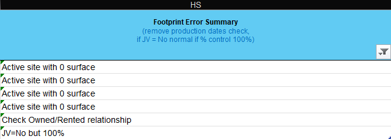
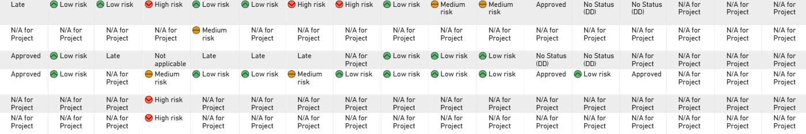

# Power BI – Real Estate Risk Management Dashboard

**End-to-end Power BI solution** built during a 10-month apprenticeship at a global Tier 1 automotive supplier (Nanterre, France, 2025).

The dashboard replaced manual, project-by-project due diligence review for a Real Estate and Finance leadership team, enabling portfolio-level risk monitoring across **526 global real estate projects** for the first time.

---

## The Problem

The Real Estate team had no consolidated view of their project portfolio. To check the status of a single project, a director had to:

1. Log into the internal platform
2. Search for the project by reference
3. Open the due diligence record manually
4. Repeat for every project — one by one

No cross-project comparison. No risk-level filter. No portfolio overview.

In addition, the Power BI data pipeline had a subtle but critical bug: **Power BI was refreshing from the wrong file**. When a user opened a SharePoint folder (without editing any file), the folder's "Date modified" timestamp updated — causing Power BI to pick up that folder as the "latest" source, even when it wasn't the most recently uploaded data file. This meant the dashboard could silently display stale data with no error message.

---

## The Solution

### 1. Data Architecture

Four data sources, all hosted on SharePoint, consolidated via Power Query:

| Table | Description |
|---|---|
| `Download` | Main project register — one row per project |
| `CARGO` | Contractual approval records (CAR ID, amounts) |
| `RealEstateProjectWP_Transactional` | Work package status per project gate |
| `WorkPackages_Referential` | Gate definitions and due diligence flags |

All joins use Left Outer logic on project reference keys. The final `Dashboard Data` table aggregates one row per project with 17 gate-level status columns (A11, C01–C12, D01, D06, D13, E04.x).

### 2. The SharePoint File Selection Fix

The root cause of the stale data bug: SharePoint updates `Date modified` on a folder whenever it is opened or browsed — not just when a file is added. Power BI was using `Date modified` as the file selection criterion, so browsing a folder could "reset" which file was considered "latest."

**Fix:** Extract the date from the **filename itself** (format: `YYYYMMDD_FileName.xlsx`) using Power Query M, and sort by that extracted date instead of the SharePoint metadata timestamp.

```powerquery
// Extract date from filename (YYYYMMDD prefix)
WithDates = Table.AddColumn(
    Keep,
    "FileDate",
    each
        let
            nm = [Name],
            y  = try Number.FromText(Text.Start(nm, 4))     otherwise null,
            m  = try Number.FromText(Text.Middle(nm, 4, 2)) otherwise null,
            d  = try Number.FromText(Text.Middle(nm, 6, 2)) otherwise null
        in
            if y <> null and m <> null and d <> null
            then #date(y, m, d)
            else null,
    type date
),
Sorted   = Table.Sort(WithDates, {{"FileDate", Order.Descending}, {"Date modified", Order.Descending}}),
PickFile = if Table.RowCount(Sorted) > 0 then Sorted{0} else error "No file found."
```

This guarantees the dashboard always loads the file whose **name** indicates the most recent date — regardless of who browsed the folder.

### 3. Risk Status Prioritisation Logic

Each work package is assigned a calculated status using a custom Power Query function that applies a strict priority hierarchy:

```
Priority: Severity > Late Task > OP Status > Due Diligence flag > Fallback
```

```powerquery
DefineWorkPackageStatus = (CurrentRow as record) as text =>
    let
        severity     = if CurrentRow[WP.Severity]        is null then "" else CurrentRow[WP.Severity],
        taskStatus   = if CurrentRow[WP.Task time status] is null then "" else CurrentRow[WP.Task time status],
        opStatus     = if CurrentRow[WP.OP Status]        is null then "" else CurrentRow[WP.OP Status],
        ddFlag       = if CurrentRow[Ref.Due Diligence]   is null then "" else CurrentRow[Ref.Due Diligence],

        GetSeverityPriority = (s as text) as number =>
            if s = "High risk"   then 3
            else if s = "Medium risk" then 2
            else if s = "Low risk"    then 1
            else 0,

        cleanedTask = Text.Lower(Text.Trim(Text.Clean(taskStatus)))
    in
        if GetSeverityPriority(severity) > 0 then severity
        else if cleanedTask = "late"          then "Late"
        else if Text.Trim(opStatus) <> ""     then opStatus
        else if ddFlag = "Yes"                then "No Status (DD Yes)"
        else                                       "No Status (DD No)"
```

The status rank system allows comparing statuses numerically across work packages and aggregating to project level:

| Status | Rank |
|---|---|
| Late | 6 |
| High risk | 5 |
| Medium risk | 4 |
| Low risk | 3 |
| Open | 2 |
| Approved | 0 |
| N/A for Project | -100 |

---

## Data Quality Audit

As part of an external audit (Big 4 consulting firm), I designed a `LET()`-based Excel formula that automatically classifies data errors across **526 real estate records**, producing a human-readable error summary per site. See [`audit/data_quality_function.md`](audit/data_quality_function.md) for the full formula, rule table and design decisions.

Across 526 records, the formula identified **6 anomalies**:

| Error Type | Count |
|---|---|
| Active site with 0 surface area | 4 |
| Inconsistent owned/rented relationship | 1 |
| JV flag inconsistency (JV=No but control = 100%) | 1 |

Each anomaly was documented and escalated to the responsible team with a corrective action summary.



---

## Repository Structure

```
/
├── README.md
├── power_query/
│   ├── 01_file_selector.md        ← SharePoint file selection fix (annotated M code)
│   ├── 02_dashboard_data.md       ← Multi-table join and transformation logic
│   └── 03_status_logic.md         ← DefineWorkPackageStatus + rank functions
├── audit/
│   └── data_quality_function.md   ← Excel LET() formula for data quality classification
└── docs/
    ├── data_model.png             ← Anonymised data model diagram
    ├── dashboard_preview.png      ← Dashboard with traffic light indicators
    └── data_quality.png           ← Data quality audit output (Footprint Error Summary)
```

---

## Visual Design: Traffic Light Status Indicators

Each gate-level status column uses **conditional formatting with icon sets** to give users an instant visual reading of portfolio risk — no need to read individual cell values.

| Icon | Status | Meaning |
|---|---|---|
| 🟢 Green circle | Low risk / Approved / Upcoming | On track |
| 🟡 Orange circle | Medium risk / Pending | Needs attention |
| 🔴 Red circle | High risk / Late | Requires immediate action |
| — | N/A for Project | Gate not applicable to this project type |
| — | No Status (DD) | Gate applicable but not yet assigned |

The icons are applied via Power BI conditional formatting rules on each gate column, mapping text status values to colour categories. A director can scan 17 gate columns across dozens of projects in a single glance and identify red flags without reading individual cell values.



## Key Technical Decisions

**Why filename-based date extraction instead of `Date modified`?**
SharePoint's `Date modified` metadata is unreliable as a file selection criterion because folder navigation updates it. Filename-based extraction is deterministic and reproducible.

**Why Power Query M instead of Python or SQL?**
The environment was Microsoft 365 / SharePoint with no data warehouse. Power Query M was the native, sustainable choice — maintainable by the team without developer access.

**Why a custom status function instead of a lookup table?**
The prioritisation logic involves conditional logic that a simple lookup table cannot express. The function is explicit, testable, and easier to audit than nested IF columns.

---

## Impact

- Replaced manual one-by-one project review with a filterable portfolio dashboard
- Leadership team (5 users) gained cross-project risk visibility for the first time
- Dashboard always loads correct source file — data freshness issue fully resolved
- 6 data anomalies formally documented and corrected before external audit delivery

---

## Author

**Salvador Jiménez-Juárez**
Mastrère Spécialisé – Digital Strategy Management, Grenoble École de Management (2025)
[LinkedIn](https://linkedin.com/in/salvador-jimenez97mx) · [Medium](https://medium.com/@salvador.jimenez-juarez)
